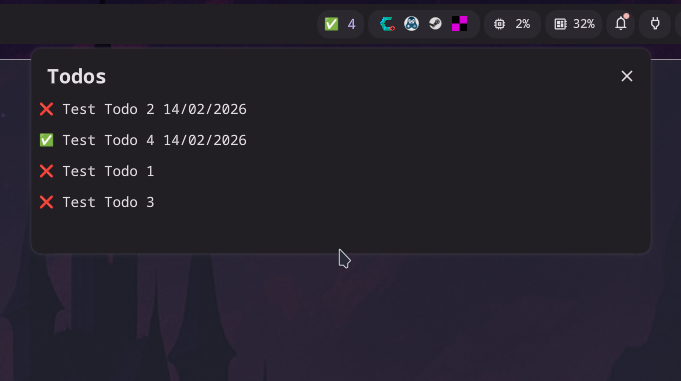

# DooitPlugin (Dank Material Shell / Quickshell)



A small DMS (Dank Material Shell) / Quickshell plugin that displays your **Dooit** todo stats in the top bar and shows a popout with your todo lists.

It uses a **Python backend** to fetch todos from Dooit and returns a single JSON payload. The QML plugin executes that script periodically, parses the JSON, and renders:

- a **bar pill** with a todo counter
- a **popout** listing:
  - todos **due today or older**
  - the **5 oldest todos without a due date**

---

## Features

- ✅ Top-bar counter (updates every minute)
- 🧾 Popout view with todo lists
- 🐍 Python script output is JSON-only (safe for `JSON.parse`)
- 🔧 Works with DMS plugin folder deployment (copy/rsync)

---

## Project Structure

```
DooitPlugin/
├─ DooitPlugin.qml
├─ DooitPluginSettings.qml   # currently not in use
├─ plugin.json               # (or your manifest file)
└─ scripts/
   └─ dooit-collector.py     # Python backend (prints JSON)
```

---

## Requirements

- Dank Material Shell / Quickshell (DMS)
- Python 3
- Dooit Python API available for the Python interpreter used by DMS:
  - `dooit.api` must be importable

> If you’re using a virtual environment in your repo, make sure the plugin calls the venv’s Python executable.

---

## Installation

1) Copy the plugin into the DMS plugin directory:

```bash
mkdir -p ~/.config/DankMaterialShell/plugins
cp -a DooitPlugin ~/.config/DankMaterialShell/plugins/
```

2) Reload plugins:

```bash
dms ipc call plugins reload DooitPlugin
```

Or restart DMS.

---

## Development Workflow (Recommended)

Because DMS may run as a systemd user service with restricted access (and symlinks to repo folders may not work),
a reliable workflow is to develop in your repo and sync into the DMS plugin folder:

```bash
rsync -a --delete ./DooitPlugin/ ~/.config/DankMaterialShell/plugins/DooitPlugin/ \
  && dms ipc call plugins reload DooitPlugin
```

---

## Configuration

### Python script path (relative)
The QML uses a relative path resolved from the plugin file location:

```qml
property string scriptPath: filePath(Qt.resolvedUrl("scripts/dooit-collector.py"))
```

### Output contract (Python → QML JSON)
The Python script must print exactly **one JSON object** on stdout:

```json
{
  "todoCount": "7",
  "todos": ["Todo A,true,null", "Todo B,true,14/02/2026"],
}
```

---

## License

This project is licensed under the **MIT License**.

In short: you are free to use, copy, modify, merge, publish, distribute, sublicense, and/or sell copies of this software, as long as you include the copyright notice and the license text in any copies or substantial portions of the software. The software is provided “as is”, without warranty of any kind.
